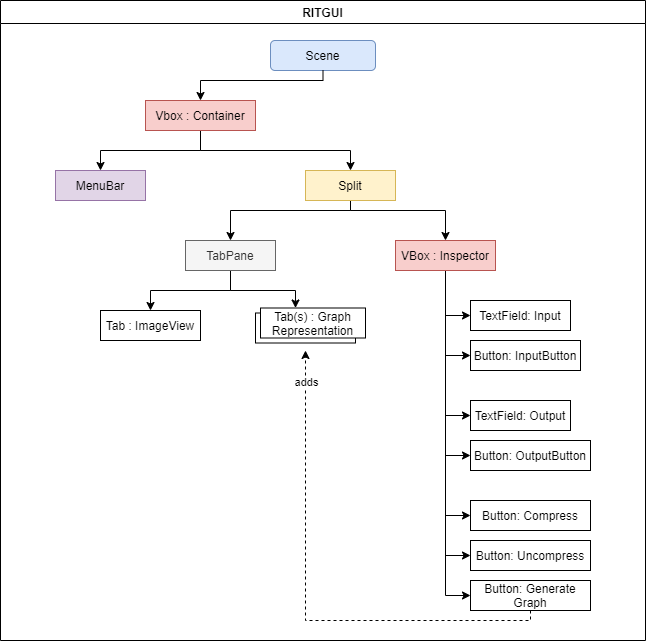

# Project Submission
**Author:** Mohammed Mehboob  
**Author:** Nabeel Khan  
**Extra Credit Implemented:** QuadTree Visualization *(Generating tree diagrams out of quad-trees)*.

# CSCI-242: Project 2: Rich Image Tool

   
>This repository contains the base-implmenetation of the **Rich Image Tool** project assigned to the students enrolled in the 2201 Fall CSCI-242 CS for Transfers course at the Rochester Institute of Technology.

## Due Dates
>* **Problem Solving:** 11/7/20 
>* **Part-1 Implementation:** 11/22/20 
>* **Part-2 Implementation:** 12/1/20 

## Table of contents
* [Introduction](#introduction)
* [Features](#features)
* [Design](#design)
    * [RIT GUI](#RIT GUI)
    * [RIT Viewer](#RIT Viewer)
    * [GUI Components](#Components)
  

---

# Introduction
The _**Rich Image Tool**_ uses a structure knows as a _**quadtree**_ to compress greayscale images. 
>The approach is to take advantage of the property of spatial coherence. That is, there is a high degree of likelihood
> that the value of a given pixel
>the image into regions that share the same pixel value

 

> ### **Objectives:**
* Implement a QuadTree data structure.
* Implement plain text based programs for compression and uncompression
* Implement JavaFX programs for image veiwing, and unified compression/uncompression.

---

# Features

1.  Easy access to raw image data, pre-order representation of quadtree and root node of quadtree through the ``RITQuadTree`` wrapper class.

2.  An interactive image viewer with panning and zooming functionality.

3.  Custom runtime exceptions to handle malformed data inputs.

4. ``Buffer`` utility class that allows for binding GUI element properties to QuadTree representations stored inside the buffer (The rendered image, input and output directories, etc). 

5. A ``Codec`` class to handle all reading and writing to and from compressed ``.rit`` and uncompressed ``.txt`` files.

6. **Extra Credit:** Generate a tree diagram out of any QuadTree object.

---

# Design

RITGUI Scene Tree

    

 

## RIT GUI

 

##### 1. Menu Bar:
        
   > A **``MenuBar``** object, consisting of *Open*, *Import*, *Export* and *Exit* ``MenuItem``s
   >      
   > * ``Open:`` The open function menu item triggers the file chooser to show an open file dialog with a ``.rit`` extension filter.  
     The chosen file is then uncompressed and its corresponding quad-tree is loaded into the buffer.  
   > * ``Import:`` Similar to the Open menu item, the Import menu item prompts the user to choose a file to open, in this case though, the file chooser has a ``.txt.`` extension filter.  
   > The chosen file is then compressed and its corresponding quad-tree is loaded into the buffer.  
     * ``Export to compressed file:`` This menu item triggers the file chooser to show a save file dialog with a ``.rit`` extension filter.  
   > The pre-order representation of the quad-tree stored inside of the buffer are then written to the chosen file. If the file doesn't exist, The program creates a new one. It does not however, create a new directory.
     The chosen file is then compressed and its corresponding quad-tree is loaded into the buffer.     
   > * ``Export to uncompressed file:`` Similar to the 'export to compressed' menu item, this menu item prompts the user to choose a file to save to, in this case though, the file chooser has a ``.txt`` extension filter. 
     The pre-order representation of the quad-tree stored inside of the buffer are then written to the chosen file. If the file doesn't exist, The program creates a new one. It does not however, create a new directory. 
     The chosen file is then compressed and its corresponding quad-tree is loaded into the buffer. 
     
                   
##### 2. TabPane:
>A **``TabPane``** object, which consists of tabs for each ``RITQuadTree`` visualization generated, and one "Image View" ``Tab`` which can't be closed.   
>
##### 3. ImageView:
> 
##### 4. Input Section:
>
##### 5. Output Section:
>
##### 6. View Button:
>![view_img]
##### 7. Compress Button:
>
##### 8. Uncompress Button:
>
##### 9. Generate Graph:
>Generates a tree diagram from the QuadTree loaded into the buffer and displays it in a new tab. 

 
 ---
 
## RIT Viewer

---

## Components

### The ``InteractiveScrollPane`` Class

>

### Cell & Edge

### GraphLayout
